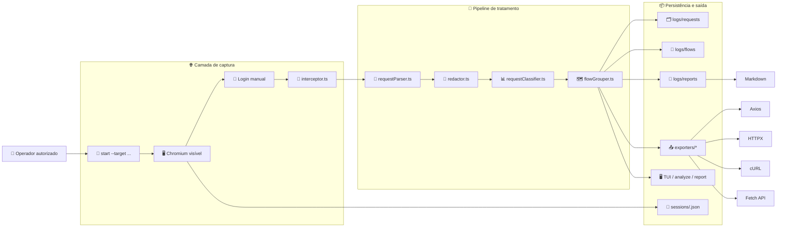
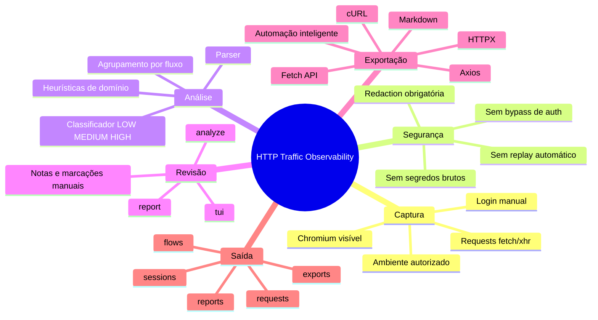

# HTTP Traffic Observability

<p align="center">
  <strong>🔎 Observabilidade de tráfego HTTP com foco em segurança, análise e documentação técnica</strong>
</p>

<p align="center">
  Ferramenta desktop/CLI em <strong>Node.js + TypeScript + Playwright</strong> para capturar, sanitizar, classificar,
  agrupar e exportar tráfego HTTP de aplicações web em <strong>ambientes autorizados</strong>.
</p>

<p align="center">
  
  
  
  
  
</p>

---

## ✨ Visão rápida

> 🛡️ Esta ferramenta foi desenhada para uso legítimo em desenvolvimento, homologação ou staging.
> Ela **não faz bypass de autenticação**, **não persiste segredos brutos** e **não executa replay automático em produção**.

### O que ela entrega

| Bloco | Função | Resultado |
| --- | --- | --- |
| 🌐 Captura | Observa `fetch`/`xhr` no Chromium visível | Requests relevantes identificadas em tempo real |
| 🧼 Sanitização | Redige headers, cookies, tokens, PII e campos sensíveis | Artefatos seguros para persistência |
| 🧠 Análise | Classifica relevância e agrupa requests por fluxo funcional | Leitura de jornadas e troubleshooting |
| 📤 Exportação | Gera Axios, HTTPX, cURL, Fetch, Markdown e automações inteligentes | Reuso técnico, documentação e simuladores reutilizáveis |
| 🖥️ Revisão | Permite análise offline e TUI interativa | Curadoria manual dos artefatos |

### Casos de uso ideais

- troubleshooting legítimo;
- entendimento de jornadas funcionais;
- documentação técnica de integrações;
- preparação de testes;
- geração de stubs seguros para integração.

---

## 🧭 Blueprint de funcionamento



### Leitura do blueprint

1. **Você inicia a captura** com um alvo autorizado.
2. **O navegador abre visível**, sem stealth e sem automação indevida de autenticação.
3. **As requests relevantes são interceptadas** e passam pelo pipeline interno.
4. **A sanitização acontece antes da gravação** de qualquer request/response.
5. **Os dados são classificados, agrupados e persistidos** em arquivos estruturados.
6. **Os artefatos podem ser revisados ou exportados** para documentação e integração.

---

## 🧠 Mapa mental do produto



---

## 🚀 Jornada de uso

### 1) Capturar

Abra o Chromium, faça login manualmente e observe o tráfego em tempo real:

```bash
npm run dev -- start --target https://seu-ambiente-autorizado.local --profile staging
```

Opções úteis:

```bash
npm run dev -- start --target https://seu-ambiente.local --debug
npm run dev -- start --target https://seu-ambiente.local --clear-session
npm run dev -- start --target https://seu-ambiente.local --profile qa
```

### 2) Revisar

Analise requests já salvas:

```bash
npm run dev -- analyze ./logs/requests
```

Com marcações manuais:

```bash
npm run dev -- analyze ./logs/requests --important 11111111-1111-1111-1111-111111111111 --note 11111111-1111-1111-1111-111111111111:submissao-critica --rename-flow flow-2-proposal-submit:proposal-confirmation
```

### 3) Exportar

Gere stubs seguros:

```bash
npm run dev -- export --format axios
npm run dev -- export --format httpx
npm run dev -- export --format curl
npm run dev -- export --format fetch
npm run dev -- export --format smart
```

A exportação `smart` usa o plano de automação salvo na request, quando existir, e gera uma função parametrizada com extração de resultados.

Exportando uma request específica:

```bash
npm run dev -- export --format axios --request-id 11111111-1111-1111-1111-111111111111
```

### 4) Documentar

Gere um relatório consolidado:

```bash
npm run dev -- report
npm run dev -- report ./logs/requests
```


### Automação inteligente na TUI

Ao revisar uma request final de fluxo na TUI, use a tecla `a` para abrir o fluxo **Gerar Automação Inteligente**:

1. o motor sugere quais campos do payload viram argumentos da função;
2. você confirma ou renomeia cada variável;
3. o motor sugere quais resultados finais devem ser extraídos da resposta;
4. você confirma quais campos entram no retorno;
5. o artefato exportado passa a retornar um objeto limpo com os resultados da simulação.

Os metadados dessa revisão ficam persistidos junto da request sanitizada, permitindo reexportação posterior.

---

## 📦 Instalação rápida

### Requisitos

- Node.js 20+
- npm 10+
- ambiente autorizado para observar a aplicação

### Instalação

```bash
npm install
npm run build
```

> ℹ️ O `postinstall` executa `playwright install chromium` para garantir o browser do Playwright.

---

## 🕹️ Comandos principais

| Comando | O que faz |
| --- | --- |
| `npm run dev -- start --target <url>` | inicia a captura com Chromium visível |
| `npm run dev -- analyze ./logs/requests` | reprocessa e revisa requests já salvas |
| `npm run dev -- tui` | abre a TUI interativa |
| `npm run dev -- export --format axios` | exporta requests em formato seguro |
| `npm run dev -- report` | gera relatório JSON/Markdown |
| `npm run dev -- clear-session` | remove a sessão persistida do perfil atual |

### Atalhos da TUI

| Tecla | Ação |
| --- | --- |
| `Tab` | alterna entre painéis |
| `j` / `k` ou setas | navega pela interface |
| `i` | marca/desmarca request importante |
| `n` | adiciona nota |
| `r` | renomeia flow |
| `g` | reaplica heurísticas de agrupamento |
| `e` | exporta a request atual |
| `a` | gera automação inteligente da request atual |
| `s` | salva artefatos revisados |
| `q` | sai da TUI |

---

## 🖼️ O que acontece durante uma captura

Durante a execução:

1. o Chromium abre visível;
2. você faz login manualmente;
3. o terminal mostra requests relevantes em tempo real;
4. ao finalizar com `Ctrl+C`, a sessão e os artefatos são persistidos.

Formato padrão no console:

```text
[HIGH] POST /api/proposal/create -> 201 in 428ms [flow: proposal-submit]
```

Com `--debug`, o terminal também mostra:

- preview sanitizado do payload;
- preview sanitizado da resposta;
- razões do score;
- motivos de ignore para requests filtradas.

---

## 🗂️ Estrutura de saída

A aplicação gera artefatos sanitizados em:

- `logs/requests/request-<id>.json`
- `logs/flows/flow-<session>-<ordem>-<nome>.json`
- `logs/reports/session-<timestamp>.json`
- `logs/exports/markdown/session-<timestamp>.md`
- `logs/exports/axios/request-<id>.ts`
- `logs/exports/httpx/request-<id>.py`
- `logs/exports/curl/request-<id>.sh`
- `logs/exports/fetch/request-<id>.ts`
- `logs/sessions/session-<timestamp>.json`
- `sessions/<profile>.json` para `storageState`

---

## 🧱 Arquitetura por camadas

### 🌐 1. Camada de navegador

- `browser/initBrowser.ts`: sobe o Chromium com `headless: false`.
- `browser/sessionManager.ts`: restaura/salva `storageState` em `/sessions` e detecta expiração básica por cookies persistidos.

### 📡 2. Camada de rede

- `network/requestParser.ts`: filtra `fetch`/`xhr`, normaliza request/response e extrai dados estruturados.
- `network/redactor.ts`: aplica mascaramento obrigatório antes de qualquer persistência.
- `network/requestClassifier.ts`: faz scoring `LOW` / `MEDIUM` / `HIGH` configurável por heurística.
- `network/domainHeuristics.ts`: reconhece estágios de domínio como cliente, simulação, proposta, documentos, contrato e finalização.
- `network/flowGrouper.ts`: agrupa requests por janela temporal, rota ativa e semântica inferida.
- `network/interceptor.ts`: conecta tudo em runtime e imprime feedback no terminal em tempo real.

### 💾 3. Camada de persistência

- `storage/saveJson.ts`: grava JSON/texto com escrita temporária e rename.
- `storage/fileManager.ts`: garante diretórios, leitura de artefatos e suporte a caminhos.

### 📤 4. Camada de exportação e relatório

- `exporters/*.ts`: gera snippets seguros para Axios, HTTPX, cURL, Fetch API e sumário Markdown.
- `exporters/shared.ts`: concentra a lógica compartilhada de headers de exportação.

### 🧭 5. Camada de CLI e revisão

- `cli/commands.ts`: orquestra `start`, `analyze`, `export`, `report` e `clear-session`.
- `cli/workspace.ts`: centraliza leitura, reagrupamento, ajustes manuais e persistência offline.
- `tui/reviewTui.ts`: TUI interativa para revisão e curadoria.

---

## 🔐 Política de segurança

### ✅ O que a ferramenta faz

- captura tráfego de rede autorizado;
- persiste somente dados redigidos;
- gera artefatos para QA, troubleshooting e integração legítima.

### ⛔ O que a ferramenta não faz

- bypass de autenticação;
- evasão, stealth ou fingerprint spoofing;
- replay automático de requests autenticadas;
- persistência de tokens/cookies reais em JSON;
- uso em produção sem autorização explícita.

---

## 🧼 Como funciona a sanitização

A sanitização acontece **antes** de salvar qualquer request/response.

Itens mascarados por padrão:

- `Authorization`
- `Cookie`
- `Set-Cookie`
- `csrf`
- `token`
- `password`
- `cpf`
- `email`
- telefones detectáveis
- padrões típicos de bearer/basic token

Exemplo:

```json
{
  "authorization": "Bearer ***REDACTED***",
  "cookie": "***REDACTED***",
  "cpf": "***REDACTED***"
}
```

### Configurando redaction customizada

Edite `config/redaction.json`:

```json
{
  "customSensitiveFields": ["customerDocument", "motherName"],
  "rules": [
    {
      "keyPattern": "customerDocument",
      "replacement": "***REDACTED***",
      "applyTo": "body"
    }
  ]
}
```

---

## ⚙️ Configuração

### `config/filters.json`

Controla allowlist e ruído irrelevante.

### `config/keywords.json`

Controla palavras-chave de relevância, thresholds, janela temporal e heurísticas do domínio.

O arquivo também define:

- `domainFlowDefinitions`
- `domainSequenceRules`

Essas estruturas modelam um domínio típico com estágios como:

- `authentication`
- `customer_lookup`
- `eligibility_bootstrap`
- `simulation`
- `proposal_submission`
- `document_upload`
- `approval_review`
- `contract_signature`
- `finalization`

Essas transições ajudam a:

- aumentar score de requests coerentes com a jornada funcional;
- separar fluxos por etapa de negócio;
- tornar a TUI mais útil para revisão ponta a ponta.

### `config/redaction.json`

Controla campos sensíveis e regras adicionais de mascaramento.

---

## 🧪 Testes e qualidade

O projeto conta com **86 testes unitários** escritos com [Vitest](https://vitest.dev/):

```bash
npm test
npm run test:watch
npm run test:coverage
```

### Módulos cobertos

- `network/redactor.ts`: sanitização de headers, query, body, truncamento e padrões PII;
- `network/requestClassifier.ts`: scoring, keywords, domínio, burst e sequência;
- `network/flowGrouper.ts`: agrupamento temporal, estatísticas, relevância e reset;
- `network/domainHeuristics.ts`: detecção de domínio, sequência e ranking;
- `utils/*.ts`: funções utilitárias;
- `exporters/shared.ts`: builder de headers;
- `cli/args.ts`: parsing de argumentos.

### Critérios de aceite cobertos

- compilação TypeScript estrita;
- CLI com os comandos solicitados;
- Chromium visível via Playwright;
- interceptação de `fetch`/`xhr` relevantes;
- persistência estruturada em JSON;
- mascaramento obrigatório antes de salvar;
- agrupamento por fluxo funcional;
- exportadores seguros;
- README completo;
- exemplo mínimo executável.

---

## 📈 Destaques da versão 0.2.0

### Correções

- Axios exporter: correção do envio incorreto de body em `GET`.
- HTTPX exporter: conversão de literais Python mais robusta usando replacer nativo de JSON.

### Novos recursos

- novo exporter com `fetch()` nativo (`--format fetch`);
- **86 testes unitários** cobrindo redactor, classifier, flowGrouper, domainHeuristics, utils e exporters;
- limpeza automática de requests pendentes após 120s no interceptor.

### Melhorias

- dependências com versões semânticas específicas;
- cache de `RegExp` no redactor;
- lógica compartilhada de headers de exportação em `exporters/shared.ts`;
- scripts `test`, `test:watch` e `test:coverage` no `package.json`.

---

## 📝 Como interpretar os relatórios

O sumário JSON/Markdown traz:

- total de requests observadas;
- total de requests relevantes;
- endpoints mais frequentes;
- endpoints mutáveis mais frequentes;
- fluxos detectados;
- requests `HIGH`;
- falhas HTTP;
- ações de usuário inferidas;
- lista de arquivos gerados.

---

## ▶️ Exemplo mínimo executável

Arquivo: `examples/minimal-run.sh`

```bash
chmod +x ./examples/minimal-run.sh
./examples/minimal-run.sh
```

Esse script:

1. instala dependências;
2. compila o projeto;
3. abre o Chromium visível apontando para `https://example.com`.

---

## ⚖️ Decisões arquiteturais

### Regras simples primeiro

A classificação usa heurísticas transparentes em vez de inferência opaca. O trade-off é perder sofisticação estatística, mas ganhar previsibilidade e facilidade de ajuste por arquivo.

### Redação centralizada

A sanitização fica concentrada em `network/redactor.ts`, reduzindo o risco de um módulo futuro persistir dados sem mascaramento.

### Sessão por perfil

O `storageState` é salvo por perfil (`default`, `staging`, `qa` etc.), melhorando o isolamento entre ambientes autorizados.

### Agrupamento heurístico

Os fluxos são inferidos por janela temporal + rota + palavras-chave + estágios de domínio, o que melhora a leitura de jornadas como:

`busca de cliente -> simulação -> proposta -> documentos -> aprovação -> contrato`

---

## ⚠️ Limitações conhecidas

- detecção de expiração de sessão é heurística e baseada em cookies persistidos;
- o campo `initiator` é aproximado a partir de frame/page;
- ações manuais do usuário são inferidas, não rastreadas diretamente do DOM;
- respostas binárias são resumidas em vez de persistidas integralmente;
- `GET` é capturada apenas quando combina com palavras-chave configuradas;
- a TUI depende de um terminal TTY real para funcionamento interativo.

---

## 🛣️ Próximos passos recomendados

1. enriquecer inferência de fluxo com eventos explícitos de navegação e formulário;
2. adicionar suporte opcional a exportação OpenAPI-like a partir dos artefatos sanitizados;
3. criar snapshots de sessão para comparar ambientes homolog/staging;
4. adicionar testes de integração end-to-end com Playwright fixtures.

---

## 🗺️ Mapa técnico do repositório

<details>
<summary><strong>Expandir árvore de arquivos</strong></summary>

```text
.
├── README.md
├── package.json
├── tsconfig.json
├── vitest.config.ts
├── .gitignore
├── config/
│   ├── filters.json
│   ├── keywords.json
│   └── redaction.json
├── examples/
│   └── minimal-run.sh
├── tests/
│   ├── domainHeuristics.test.ts
│   ├── exporters.test.ts
│   ├── flowGrouper.test.ts
│   ├── redactor.test.ts
│   ├── requestClassifier.test.ts
│   └── utils.test.ts
├── logs/
│   ├── sessions/
│   ├── requests/
│   ├── flows/
│   ├── reports/
│   └── exports/
│       ├── axios/
│       ├── httpx/
│       ├── curl/
│       ├── fetch/
│       └── markdown/
├── sessions/
└── src/
    ├── browser/
    ├── cli/
    ├── config/
    ├── exporters/
    ├── network/
    ├── storage/
    ├── tui/
    ├── types/
    ├── utils/
    └── index.ts
```

</details>
